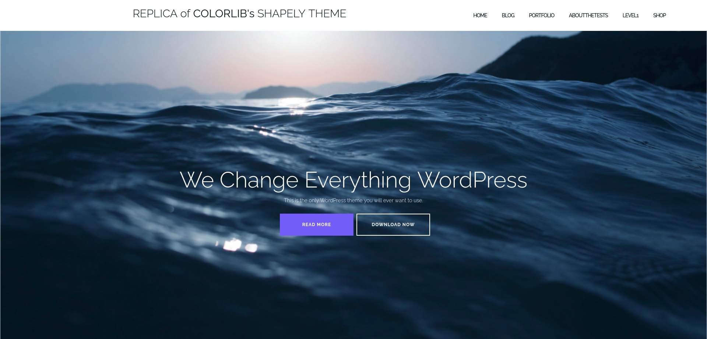

# Replica of Colorlib's Shapely theme

This is a solution to the [OpenCampus WebDev Program 2025's ](https://edu.opencampus.sh/en) challenge "Create a replica of [Colorlib's fantastic Shapely theme for WordPress](https://colorlib.com/wp/themes/shapely/)". The goal was, to program a fully responsive working equivalent of the Shapely theme using only HTML5 and CSS3. JavaScript was allowed only to ensure functionality of the tablet and mobile version's Hamburger menu button. The formatting specifications for the texts differed slightly from those of the original.

## Table of contents

- [Screenshot](#screenshot)
- [Links](#links)
- [Built with](#built-with)
- [Author](#author)

### Screenshot

### Links

- Solution URL:[ https://github.com/vanhog/ocwebdev_ac_shapely](https://github.com/vanhog/ocwebdev_ac_shapely)
- Live Site URL: [https://dees-ocwebdev-shapely-replica.netlify.app/](https://dees-ocwebdev-shapely-replica.netlify.app/)

### Built with

- Semantic HTML5 markup
- CSS custom properties
- a piece of JavaScript
- Tailwindcss
- Flexbox
- Mobile-first workflow

## Author

- Website - [Dieter H. Hoogestraat (dee van hog)](https://www.hoogestraat.com)
- Github - [@vanhog](https://github.com/vanhog)
